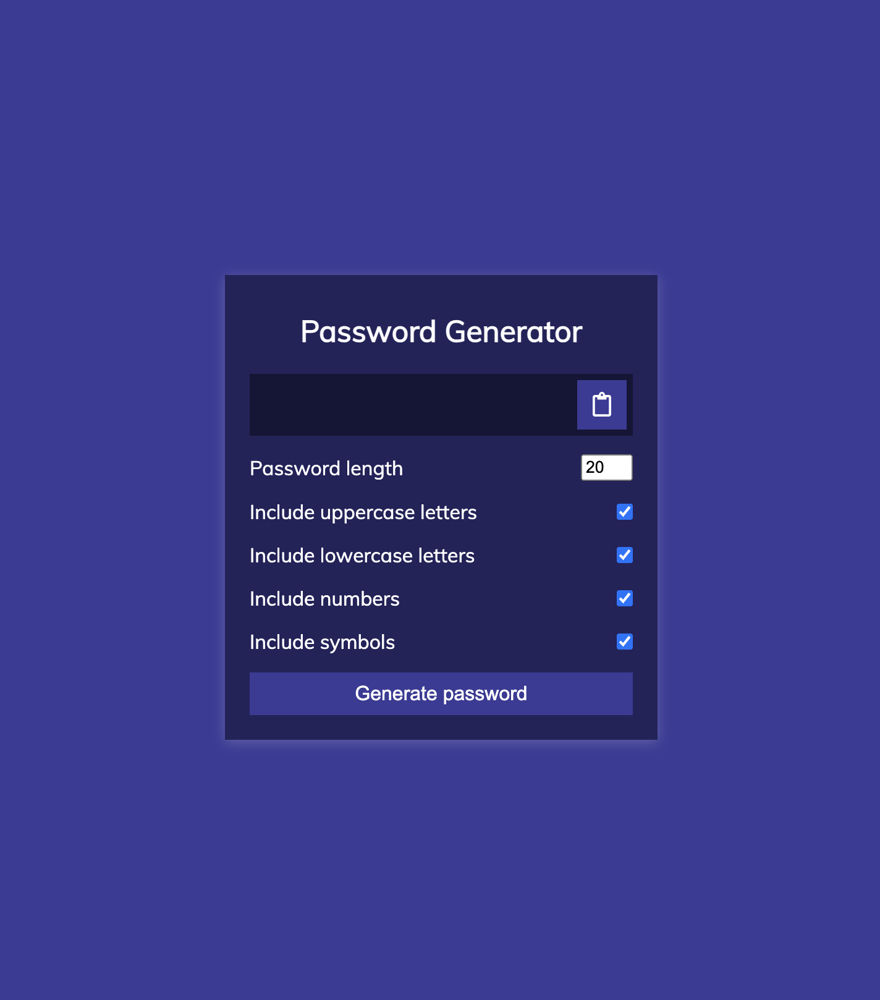
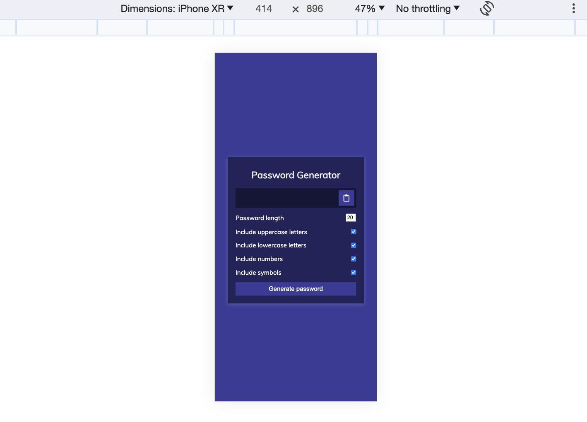

# Password Generator 

It involves taking one of Florin 100 DAYS - 100 PROJECTS CHALLENGE and this was project number 13.

## Table of contents

- [Overview](#overview)
  - [The challenge](#the-challenge)
  - [Screenshot](#screenshot)
  - [Links](#links)
- [My process](#my-process)
  - [Built with](#built-with)
  - [What I learned](#what-i-learned)
  - [Continued development](#continued-development)
  - [Useful resources](#useful-resources)
- [Author](#author)
- [Acknowledgments](#acknowledgments)


## Overview

### The challenge

The challenge involves creating a password generator using javascript.

### Screenshot

The screenshot below shows the desktop design:



The screenshot below shows the mobile design:



### Links

- Solution URL: [Add solution URL here](https://github.com/richard9809/password-generator)
- Live Site URL: [Add live site URL here](https://vermillion-kitten-8921d1.netlify.app)

## My process

### Built with

- Semantic HTML5 markup
- CSS custom properties
- Mobile-first workflow
- Javascript
- Math functions


### What I learned

During this project, I learned how to copy text in a clipboard as shown below:

```js
clipboardEl.addEventListener("click", () => {
  const textarea = document.createElement("textarea");
  const password = resultEl.innerText;

  if (!password) {
    return;
  }

  textarea.value = password;
  document.body.appendChild(textarea);
  textarea.select();
  document.execCommand("copy");
  textarea.remove();
  alert("Password copied to clipboard");
});
```

I also learnt how to generate password using Math.random() function.

```js
function generatePassword(lower, upper, number, symbol, length) {
  // 1. Init pw var
  // 2. Filter out unchecked types
  // 3. Loop over length call generator function for each type
  // 4. Add final pw to the pw var and return

  let generatedPassword = "";

  const typesCount = lower + upper + number + symbol;

  const typesArr = [{ lower }, { upper }, { number }, { symbol }].filter(
    (item) => Object.values(item)[0]
  );

  if (typesCount === 0) {
    return "";
  }

  for (let i = 0; i < length; i += typesCount) {
    typesArr.forEach((type) => {
      const funcName = Object.keys(type)[0];
      generatedPassword += randomFunc[funcName]();
    });
  }

  const finalPassword = generatedPassword.slice(0, length);

  return finalPassword;
}
```

### Continued development

I plan to continue refining my skills in javascript by building more websites.


### Useful resources

- [MDN Web Docs](https://developer.mozilla.org/en-US/) - An excellent resource for HTML, CSS, and JavaScript documentation.

- [Florin Website](https://www.florin-pop.com/blog/2019/09/100-days-100-projects/) - This is an amazing website that has 100 Days - 100 Projects challenge that one can take to improve their javascript skills.

## Author

- Frontend Mentor - [@richard9809](https://www.frontendmentor.io/profile/richard9809)
- Twitter - [@rmulu333](https://www.twitter.com/rmulu333)

## Acknowledgments

I'd like to acknowledge the helpful resources and support from the [Florin's Website](https://www.florin-pop.com/blog/2019/09/100-days-100-projects/). This project allowed me to practice and improve my javascript skills.